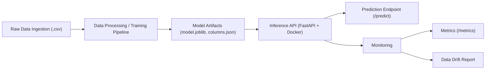
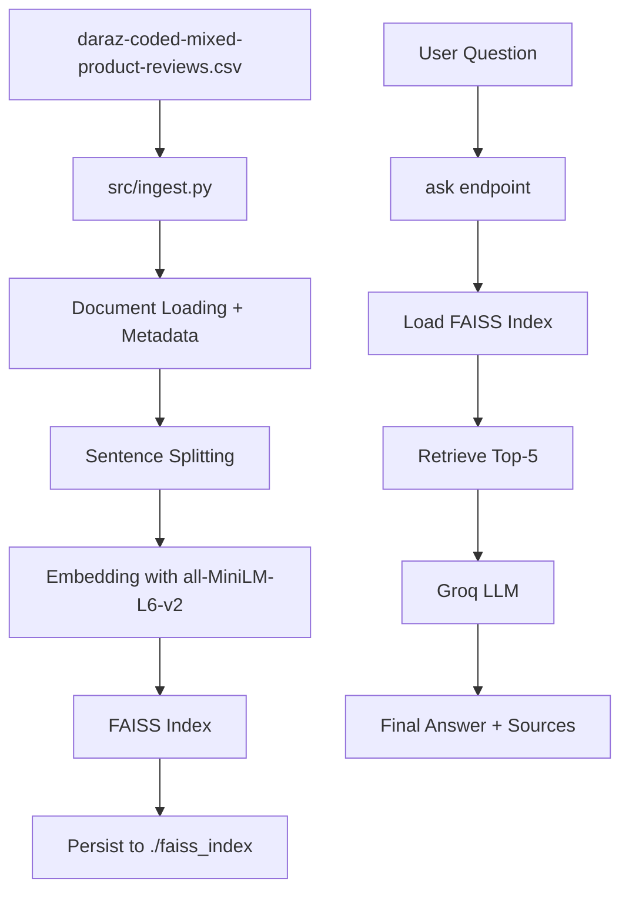
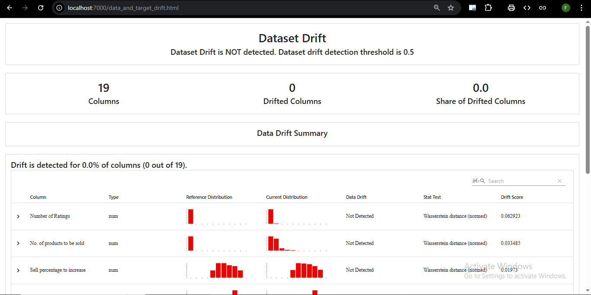
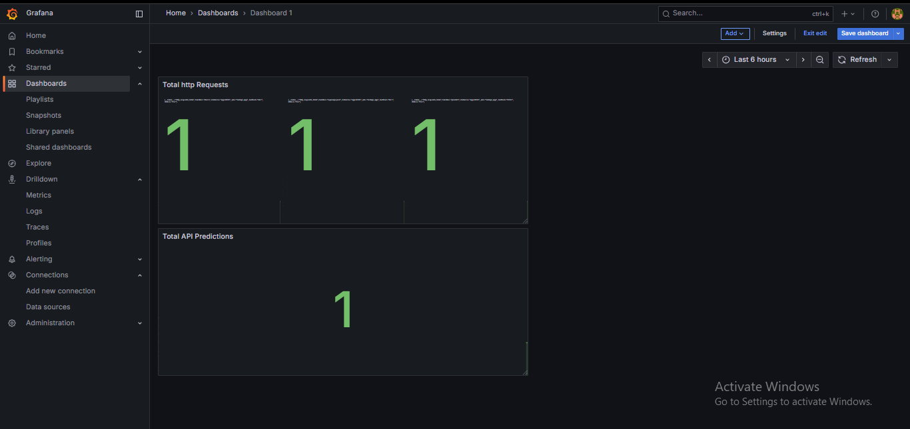
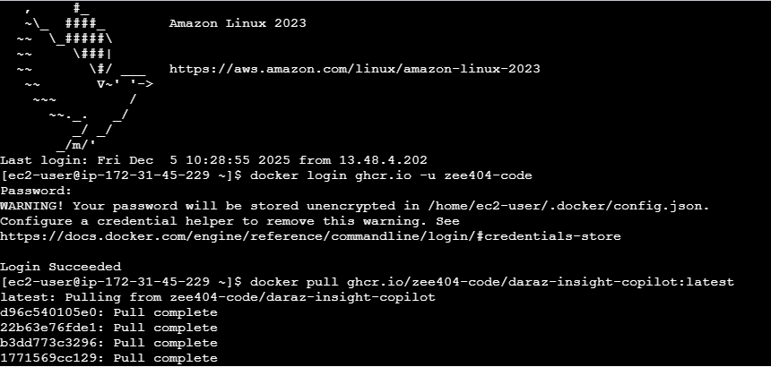
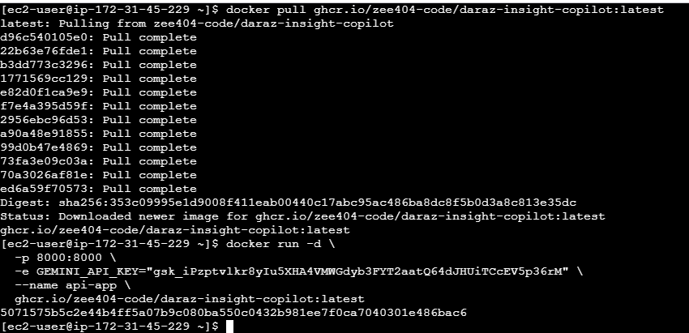
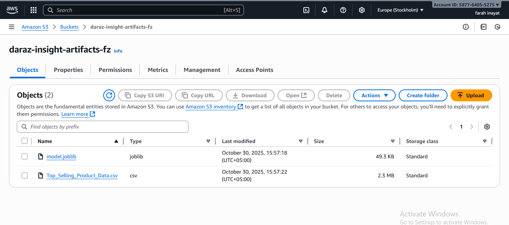
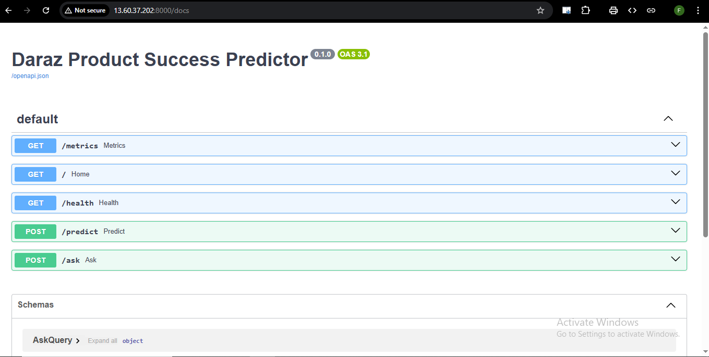

# Daraz Product Insight Assistant


> An end-to-end analytics and decision support system that combines predictive modeling (ML) and natural-language insight generation (LLM) for Daraz sellers.

---
## Project Overview & LLMOps Objectives

This project integrates **Machine Learning** and **Large Language Models (LLM)** into a unified pipeline to help sellers optimize their product listings.

### Core Objectives
- **Predictive Analytics:** Estimate product success scores based on metadata (Price, Ratings, Categories).
- **Context-Aware Chat:** Provide intelligent Q&A using **RAG (Retrieval-Augmented Generation)**.
- **LLMOps Automation:** CI/CD pipelines for testing, linting, and containerization.
- **Monitoring & Observability:** Track model drift, system health, and RAG metrics.
- **Guardrails & Safety:** Prevent PII leakage, block prompt injection, validate inputs/outputs.

## Architecture



## Quick Start

1.  **Clone the repository:**
    ```bash
    git clone [https://github.com/zee404-code/daraz-insight-copilot.git](https://github.com/zee404-code/daraz-insight-copilot.git)
    cd daraz-insight-copilot
    ```

2.  **Create and activate a virtual environment (Recommended):**
    ```bash
    python -m venv .venv
    # On Windows Powershell:
    .\.venv\Scripts\Activate
    # On Linux/macOS/Git Bash:
    # source .venv/bin/activate
    ```

3.  **Install dependencies:**
    ```bash
    pip install -r requirements.txt
    pip install -e . # Install local package
    ```

4.  **Run the development server:**
    ```bash
    make dev
    ```

5.  Open your browser to `http://localhost:8000/docs` to see the API documentation and test the endpoints.

## API Usage Example

You can test the prediction endpoint using curl:
    ```bash
    curl -X 'POST' \
        'http://localhost:8000/predict' \
        -H 'accept: application/json' \
        -H 'Content-Type: application/json' \
        -d '{
            "Original_Price": 1650,
            "Discount_Price": 725,
            "Number_of_Ratings": 31,
            "Positive_Seller_Ratings": 86,
            "Ship_On_Time": 0,
            "Chat_Response_Rate": 93,
            "No_of_products_to_be_sold": 113.79,
            "Category": "Watches, Bags, Jewellery",
            "Delivery_Type": "Free Delivery",
            "Flagship_Store": "No"
        }'
    ```

Expected Response
    ```bash
    {
        "predicted_success_score": 100.0
    }
    ```
## RAG Pipeline & Deployment Guide

**Vector Store:** FAISS
**Embedding Model:** all-MiniLM-L6-v2
**LLM:** Groq Llama-3.1-8B

### Architecture Diagram


<br>


## Responsible AI & Guardrails

The **Daraz Insight Copilot** is built to be a **helpful, harmless, and honest** AI assistant dedicated exclusively to e-commerce analytics on the Daraz platform. We enforce strong Responsible AI principles through multiple technical and prompt-based guardrails.

## 1. Topic Restriction Guardrails
**Goal**: Prevent discussion of sensitive, political, illegal, or harmful topics unrelated to e-commerce.

- **Implementation**
  The system prompt strictly defines the assistant’s persona:
  > “You are an e-commerce analyst for Daraz. You only answer questions using the provided product reviews and data.”

- **Behavior**
  Off-topic queries (e.g., “Who is the president?”, “How do I make a bomb?”, or any non-e-commerce request) trigger retrieval of irrelevant product reviews. With no relevant context available, the model is instructed to respond:
  > “I cannot answer this question based on the available product data.”

## 2. Anti-Hallucination Measures
**Goal**: Eliminate invented products, fake reviews, or fabricated insights.

- **Implementation**
  Full **Retrieval-Augmented Generation (RAG)** workflow powered by a FAISS vector index of real Daraz reviews.

- **Constraint**
  The model is explicitly prohibited from using its pre-trained knowledge for product-related facts. Every factual claim **must** be grounded in retrieved chunks, ensuring 100% traceability to real data.

## 3. Tone & Style Guidelines
**Goal**: Maintain professional, objective, and business-appropriate communication.

- **Implementation**
  Prompt instructions enforce:
  > “Responses must be concise, data-driven, and professional.”

- **Result**
  No slang, memes, overly casual language, or aggressive tone — ideal for analysts, merchants, and business users.

## 4. Bias Mitigation
**Goal**: Deliver fair and accurate sentiment analysis across diverse user expressions.

- **Dataset**
  Includes mixed-language (English + Roman Urdu) reviews to properly capture local nuances and avoid penalizing non-native English speakers.

- **Transparency**
  Every answer includes the exact review snippets used as sources, enabling users to verify that summaries faithfully reflect the underlying data.

By combining strict persona definition, RAG grounding, clear style rules, and transparent sourcing, Daraz Insight Copilot stays focused, truthful, and responsible at all times.

We implemented a custom **Policy Engine** (`src/app/guardrails.py`) that intercepts requests at two stages to ensure system safety and compliance.

### 1. Input Validation (Pre-RAG)
Before the User Query reaches the RAG system, it is scanned using Regex and Keyword Matching. If a rule is triggered, the API returns a `400 Bad Request` immediately, saving RAG computational costs.

* **PII Detection:** Blocks Pakistani CNIC patterns (`\d{5}-\d{7}-\d{1}`) and Phone numbers to protect sensitive data.
  <br>
  

* **Prompt Injection:** Scans for adversarial phrases like "ignore previous instructions", "delete database", or "system prompt".
  <br>
  

### 2. Output Moderation (Post-RAG)
The LLM's generated answer is scanned before being sent back to the user.

* **Toxicity Filter:** Checks against a ban-list of toxic/inappropriate terms.
* **Hallucination/Quality Check:** Flags responses that are unusually short or empty.
* **Action:** If triggered, the answer is replaced with a standard safety message ("I cannot answer this due to safety guidelines").

### 3. Observability
All events are logged to Prometheus using a custom counter `guardrail_events_total`, labeled by trigger type (`input_validation`, `output_moderation`).


## Monitoring

### MLflow Experiment Tracking

Model training experiments, parameters, metrics, and artifacts are tracked using MLflow. To view the MLflow UI locally:
1. Activate the virtual environment.
2. Run `mlflow ui` in your terminal.
3. Open `http://localhost:5000` in your browser.

The model is registered in the MLflow Model Registry under the name `daraz-product-success-predictor`.

### Data Drift

Data drift between the training and test sets is monitored using Evidently. A pre-generated report is available in the `reports/` folder.

To view the dashboard, which is served using Docker Compose:
1. Ensure Docker Desktop is running.
2. Run `docker-compose up --build` in your terminal.
3. Open `http://localhost:7000/data_and_target_drift.html` in your browser.



### API Metrics (Prometheus & Grafana)

A full Prometheus & Grafana stack is included in the Docker Compose file.
1. Run `docker-compose up --build`
2. API metrics are collected by Prometheus at `http://localhost:9090`.
3. Grafana is available at `http://localhost:3000` (login: admin/admin). The Prometheus data source is pre-configured.



* **GPU Metrics:** This project utilizes CPU for training and inference, so GPU-specific metrics are not applicable.

### LLM Evaluation

We monitor the RAG pipeline using a dedicated Grafana dashboard powered by Prometheus metrics.

* **Token Usage:** Tracks `llm_token_usage_total` (Input vs Output) to monitor usage volume.
* **Cost Estimation:** Tracks `llm_cost_total` based on a calculated rate per 1k tokens.
* **RAG Latency:** A Histogram (`rag_request_latency_seconds`) visualizing the response time distribution.
* **Safety Violations:** Tracks `guardrail_events_total` to see how often PII or Injection attacks are attempted.

*To view this dashboard:*
1.  Run `docker-compose up`
2.  Go to `http://localhost:3000`
3.  Import the JSON dashboard located in `config/grafana_dashboard.json` (if provided) or build a panel using the metrics above.

## LLM Monitoring

We employ a dual-stack monitoring approach to ensure the reliability of both the Generative (LLM) and Predictive (ML) components.

### 1. Real-time Metrics (Grafana + Prometheus)
We track operational metrics for the RAG pipeline using a Grafana dashboard.
* **Token Usage & Cost:** Tracks `llm_token_usage_total` to estimate API costs ($0.50/1M input, $1.50/1M output).
* **RAG Latency:** Monitors the P95 and P99 latency of the `/ask` endpoint to ensure responsiveness.
* **Safety Violations:** Logs `guardrail_events_total` to track attempted attacks (Injection/PII).


<br>

<br>

<br>


### 2. Data Drift Monitoring (Evidently)
We monitor the integrity of our retrieval corpus and tabular data using **Evidently AI**.
* **Retrieval Corpus Drift:** Detects semantic shifts in the product descriptions that could degrade RAG performance.
* **Feature Drift:** specific checks on key features like `Original_Price` and `Ratings`.


## Cloud Deployment

This project is deployed and hosted on **Amazon Web Services (AWS)**
using three key services: **EC2**, **S3**, and **CloudWatch**,
fulfilling the **D9 Deployment requirement**.



<br>



## How the ML Workflow Interacts with AWS

### **1. Training (Local)**

The machine learning model is trained locally using:

``` bash
python train.py
```

This produces the following artifacts:

-   `model.joblib`
-   `faiss_index/` folder
-   `my_model/` folder (Sentence Transformer model)

### **2. Artifact Storage (S3)**

Due to GitHub file-size limits and Docker build timeouts, heavy
artifacts are stored in **Amazon S3**.

Artifacts stored:

-   `daraz-code-mixed-product-reviews.csv`
-   `faiss_index/` (Vector Database)
-   `my_model/` (Sentence Transformer)



### **3. Inference (EC2)**

An **EC2 t3.micro** instance hosts the live FastAPI application.

Instead of downloading models inside Docker (which causes timeouts), the
instance downloads artifacts from S3 **at the host level**, and they are
mounted into the container.


### **4. Monitoring (CloudWatch)**

CloudWatch is used to track:

-   CPU usage\
-   Memory usage

## AWS Services Used

### **S3 --- Simple Storage Service**

Stores heavy ML artifacts and acts as the "teleporter" between local
development and the EC2 server.

### **EC2 --- Elastic Compute Cloud**

Runs the production API using Docker with host networking.

### **GHCR --- GitHub Container Registry**

Stores the lightweight Docker image.

# 🚀 Deployment Guide (Full Reproduction Steps)

## **1. Infrastructure Setup**

### **S3**

Create a bucket (example: `daraz-insight-artifacts-fz`) and upload:

-   `reviews.csv`
-   `faiss_index/`
-   `my_model/`

### **EC2**

-   Start a **t3.micro** instance\
-   OS: Amazon Linux 2023

### **Security Groups**

  Port   Purpose      Source
  ------ ------------ -----------
  22     SSH          Your IP
  8000   API Access   0.0.0.0/0

## **2. Server Configuration**

``` bash
sudo yum update -y
sudo yum install docker -y
sudo service docker start
sudo usermod -a -G docker ec2-user
```

### **Create Swap Memory**

``` bash
sudo dd if=/dev/zero of=/swapfile bs=128M count=32
sudo chmod 600 /swapfile
sudo mkswap /swapfile
sudo swapon /swapfile
exit
```

## **3. Artifact Injection**

``` bash
aws configure
aws s3 cp s3://daraz-insight-artifacts-fz/daraz-code-mixed-product-reviews.csv reviews.csv
aws s3 cp s3://daraz-insight-artifacts-fz/faiss_index/ faiss_index/ --recursive
aws s3 cp s3://daraz-insight-artifacts-fz/my_model/ my_model/ --recursive
```

## **4. Run the Container**

``` bash
docker login ghcr.io -u <YOUR_GITHUB_USERNAME>
docker pull ghcr.io/zee404-code/daraz-insight-copilot:latest
```

``` bash
docker run -d \
  --network host \
  --dns 8.8.8.8 \
  -v "$(pwd)/reviews.csv:/app/reviews.csv" \
  -v "$(pwd)/faiss_index:/app/faiss_index" \
  -v "$(pwd)/my_model:/app/my_model" \
  -e GROQ_API_KEY="<YOUR_GROQ_API_KEY>" \
  -e TRANSFORMERS_OFFLINE=1 \
  -e HF_HUB_OFFLINE=1 \
  -e SENTENCE_TRANSFORMERS_HOME="/app/my_model" \
  --name api-app \
  ghcr.io/zee404-code/daraz-insight-copilot:latest
```

# ✅ Verification

Visit:

    http://<EC2_PUBLIC_IP>:8000/docs

You should see the live Swagger documentation.


<br>

## Make Targets

This project uses a `Makefile` for common development tasks:

* `make lint`: Runs linting checks using `ruff` and `black` to ensure code quality and consistent formatting.
* `make test`: Runs the unit tests located in the `tests/` directory using `pytest`.
* `make dev`: Starts the FastAPI application locally using `uvicorn` with live reloading enabled. Access the API at `http://localhost:8000`.
* `make docker`: Builds the Docker image for the application, tagging it as `daraz-predictor:latest`.
* `make run-docker`: Runs the application inside a Docker container, exposing it on `http://localhost:8000`.
* `make all`: A shortcut to run both `make lint` and `make test`.

## FAQ

**Q: `make` command not found (Windows)?**
**A:** The `make` command is not standard on Windows Command Prompt or PowerShell. Please use **Git Bash** (which comes with Git for Windows) or **WSL (Windows Subsystem for Linux)** to run `make` commands. Alternatively, you can run the underlying commands directly (e.g., `uvicorn src.app.main:app --reload` instead of `make dev`).

**Q: `ModuleNotFoundError: No module named 'src'` or `ModuleNotFoundError: No module named 'app'` when running tests or scripts?**
**A:** This usually means your local package isn't installed correctly.
    1. Ensure you have created `src/__init__.py` and `src/app/__init__.py`.
    2. Ensure you have a `pyproject.toml` file in the root directory.
    3. Activate your virtual environment (`.\.venv\Scripts\Activate` or `source .venv/bin/activate`).
    4. Run `pip install -e .` from the project root directory.

**Q: Error related to script execution being disabled (PowerShell)?**
**A:** You need to allow script execution for the current user. Run this command in PowerShell (as administrator if needed):
   ```powershell
   Set-ExecutionPolicy -ExecutionPolicy RemoteSigned -Scope CurrentUser
   ```

Answer 'Y' if prompted.

**Q: Docker build fails?**
**A:** Ensure Docker Desktop is running. Check the error messages in the build log for specific issues (e.g., network errors, problems installing dependencies). Ensure your Dockerfile is in the root directory.

**Q: Pre-commit hook fails?**
**A:** Run pre-commit run --all-files locally. This will show you the errors and automatically fix many of them. Commit the changes made by the hooks.
