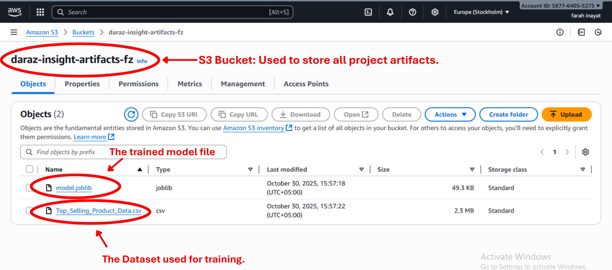
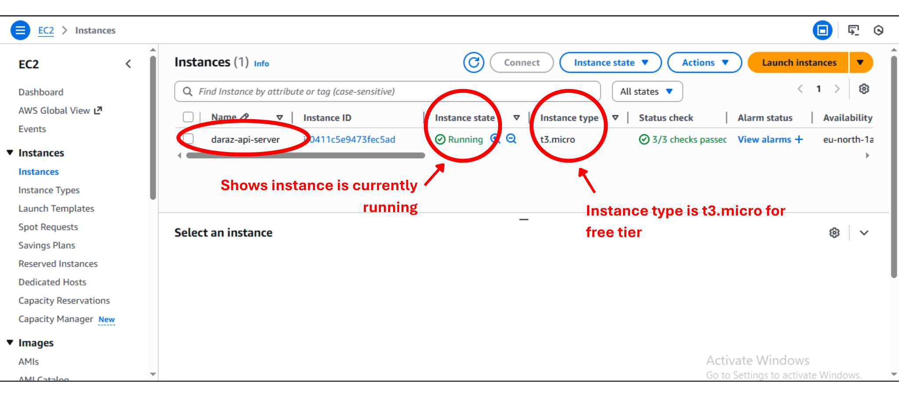
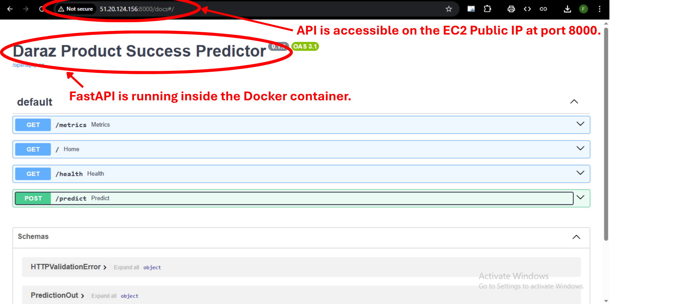
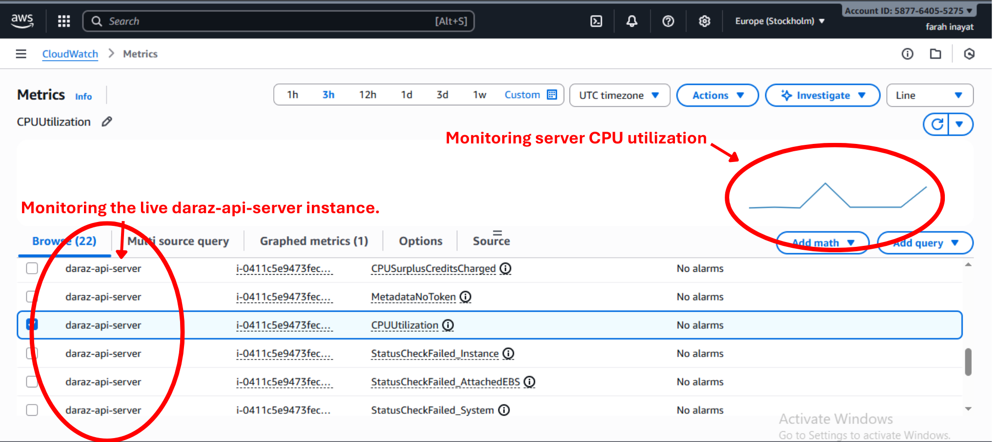

# Daraz Product Insight Assistant


> An end-to-end analytics and decision support system that combines predictive modeling (ML) and natural-language insight generation (LLM) for Daraz sellers.

---
## Project Overview & LLMOps Objectives

This project integrates **Machine Learning** and **Large Language Models (LLM)** into a unified pipeline to help sellers optimize their product listings.

### Core Objectives
- **Predictive Analytics:** Estimate product success scores based on metadata (Price, Ratings, Categories).
- **Context-Aware Chat:** Provide intelligent Q&A using **RAG (Retrieval-Augmented Generation)**.
- **LLMOps Automation:** CI/CD pipelines for testing, linting, and containerization.
- **Monitoring & Observability:** Track model drift, system health, and RAG metrics.
- **Guardrails & Safety:** Prevent PII leakage, block prompt injection, validate inputs/outputs.

## Architecture


## Quick Start

1.  **Clone the repository:**
    ```bash
    git clone [https://github.com/zee404-code/daraz-insight-copilot.git](https://github.com/zee404-code/daraz-insight-copilot.git)
    cd daraz-insight-copilot
    ```

2.  **Create and activate a virtual environment (Recommended):**
    ```bash
    python -m venv .venv
    # On Windows Powershell:
    .\.venv\Scripts\Activate
    # On Linux/macOS/Git Bash:
    # source .venv/bin/activate
    ```

3.  **Install dependencies:**
    ```bash
    pip install -r requirements.txt
    pip install -e . # Install local package
    ```

4.  **Run the development server:**
    ```bash
    make dev
    ```

5.  Open your browser to `http://localhost:8000/docs` to see the API documentation and test the endpoints.

## API Usage Example

You can test the prediction endpoint using curl:
    ```bash
    curl -X 'POST' \
        'http://localhost:8000/predict' \
        -H 'accept: application/json' \
        -H 'Content-Type: application/json' \
        -d '{
            "Original_Price": 1650,
            "Discount_Price": 725,
            "Number_of_Ratings": 31,
            "Positive_Seller_Ratings": 86,
            "Ship_On_Time": 0,
            "Chat_Response_Rate": 93,
            "No_of_products_to_be_sold": 113.79,
            "Category": "Watches, Bags, Jewellery",
            "Delivery_Type": "Free Delivery",
            "Flagship_Store": "No"
        }'
    ```

Expected Response
    ```bash
    {
        "predicted_success_score": 100.0
    }
    ```
## RAG Pipeline & Deployment Guide

**Vector Store:** FAISS
**Embedding Model:** all-MiniLM-L6-v2
**LLM:** Groq Llama-3.1-8B

### Architecture Diagram


<br>


## Guardrails & Safety Mechanisms (D3)

We implemented a custom **Policy Engine** (`src/app/guardrails.py`) that intercepts requests at two stages to ensure system safety and compliance.

### 1. Input Validation (Pre-RAG)
Before the User Query reaches the RAG system, it is scanned using Regex and Keyword Matching. If a rule is triggered, the API returns a `400 Bad Request` immediately, saving RAG computational costs.

* **PII Detection:** Blocks Pakistani CNIC patterns (`\d{5}-\d{7}-\d{1}`) and Phone numbers to protect sensitive data.
  <br>
  

* **Prompt Injection:** Scans for adversarial phrases like "ignore previous instructions", "delete database", or "system prompt".
  <br>
  

### 2. Output Moderation (Post-RAG)
The LLM's generated answer is scanned before being sent back to the user.

* **Toxicity Filter:** Checks against a ban-list of toxic/inappropriate terms.
* **Hallucination/Quality Check:** Flags responses that are unusually short or empty.
* **Action:** If triggered, the answer is replaced with a standard safety message ("I cannot answer this due to safety guidelines").

### 3. Observability
All events are logged to Prometheus using a custom counter `guardrail_events_total`, labeled by trigger type (`input_validation`, `output_moderation`).


## Monitoring

### MLflow Experiment Tracking

Model training experiments, parameters, metrics, and artifacts are tracked using MLflow. To view the MLflow UI locally:
1. Activate the virtual environment.
2. Run `mlflow ui` in your terminal.
3. Open `http://localhost:5000` in your browser.

The model is registered in the MLflow Model Registry under the name `daraz-product-success-predictor`.

### Data Drift

Data drift between the training and test sets is monitored using Evidently. A pre-generated report is available in the `reports/` folder.

To view the dashboard, which is served using Docker Compose:
1. Ensure Docker Desktop is running.
2. Run `docker-compose up --build` in your terminal.
3. Open `http://localhost:7000/data_and_target_drift.html` in your browser.


### API Metrics (Prometheus & Grafana)

A full Prometheus & Grafana stack is included in the Docker Compose file.
1. Run `docker-compose up --build`
2. API metrics are collected by Prometheus at `http://localhost:9090`.
3. Grafana is available at `http://localhost:3000` (login: admin/admin). The Prometheus data source is pre-configured.


* **GPU Metrics:** This project utilizes CPU for training and inference, so GPU-specific metrics are not applicable.

### LLM Evaluation

We monitor the RAG pipeline using a dedicated Grafana dashboard powered by Prometheus metrics.

* **Token Usage:** Tracks `llm_token_usage_total` (Input vs Output) to monitor usage volume.
* **Cost Estimation:** Tracks `llm_cost_total` based on a calculated rate per 1k tokens.
* **RAG Latency:** A Histogram (`rag_request_latency_seconds`) visualizing the response time distribution.
* **Safety Violations:** Tracks `guardrail_events_total` to see how often PII or Injection attacks are attempted.

*To view this dashboard:*
1.  Run `docker-compose up`
2.  Go to `http://localhost:3000`
3.  Import the JSON dashboard located in `config/grafana_dashboard.json` (if provided) or build a panel using the metrics above.

## LLM Monitoring

We employ a dual-stack monitoring approach to ensure the reliability of both the Generative (LLM) and Predictive (ML) components.

### 1. Real-time Metrics (Grafana + Prometheus)
We track operational metrics for the RAG pipeline using a Grafana dashboard.
* **Token Usage & Cost:** Tracks `llm_token_usage_total` to estimate API costs ($0.50/1M input, $1.50/1M output).
* **RAG Latency:** Monitors the P95 and P99 latency of the `/ask` endpoint to ensure responsiveness.
* **Safety Violations:** Logs `guardrail_events_total` to track attempted attacks (Injection/PII).


### 2. Data Drift Monitoring (Evidently)
We monitor the integrity of our retrieval corpus and tabular data using **Evidently AI**.
* **Retrieval Corpus Drift:** Detects semantic shifts in the product descriptions that could degrade RAG performance.
* **Feature Drift:** specific checks on key features like `Original_Price` and `Ratings`.


## Cloud Deployment

This project is deployed and hosted on **Amazon Web Services (AWS)** using three distinct services: **EC2**, **S3**, and **CloudWatch**, fulfilling the D9 requirement.

### How the ML Workflow Interacts with AWS

1.  **Training (Local):** The model is trained locally using `python train.py`. This script also generates the `model.joblib` artifact.
2.  **Data/Model Storage (S3):** The `Top_Selling_Product_Data.csv` dataset and the final `model.joblib` artifact are manually uploaded to an **S3 bucket** for persistent, durable storage.
3.  **Inference (EC2):** An **EC2 instance** runs our Docker container. The container (built by the CI/CD pipeline) pulls the code, and when the API starts, it loads the model from its local `models/` directory (which was part of the build).
4.  **Monitoring (CloudWatch):** **CloudWatch** automatically monitors the EC2 instance (CPU, Network, etc.) to ensure the health of our inference API server.

### Services Used

* **S3 (Simple Storage Service):** Used for persistent data storage.
    * **Why:** S3 is a highly durable and scalable service perfect for storing project artifacts.
    * **How:** The `Top_Selling_Product_Data.csv` dataset and the trained `model.joblib` are stored in an S3 bucket.
    * 

* **EC2 (Elastic Compute Cloud):** Used to host the live inference API.
    * **Why:** An EC2 `t3.micro` instance provides a free-tier-eligible virtual server to run our Docker container 24/7.
    * **How:** The API's Docker image (built by our CI/CD pipeline and stored in GHCR) is pulled and run on an Amazon Linux EC2 instance.
    * 
    * 

* **CloudWatch:** Used for basic infrastructure monitoring.
    * **Why:** CloudWatch is automatically integrated with EC2 and provides essential metrics (CPU, Network, Disk) to monitor the health and performance of our API server.
    * 

### Reproduction Steps & Security

1.  Launch a `t2.micro` EC2 instance with an Amazon Linux AMI.
2.  **Configure the Security Group:** To follow security best practices, access is restricted.
    * Allow inbound TCP traffic on port `22` (SSH) from `My IP`.
    * Allow inbound TCP traffic on port `8000` (API) from `My IP`.
3.  Connect to the instance via SSH.
4.  Install Docker: `sudo yum update -y && sudo yum install docker -y && sudo service docker start && sudo usermod -a -G docker ec2-user`
5.  Log out and log back in.
6.  Log in to GHCR: `docker login ghcr.io -u <YOUR-GITHUB-USERNAME>` (use a PAT as the password).
7.  Pull and run the image: `docker pull ghcr.io/zee404-code/daraz-insight-copilot:latest`
8.  Run: `docker run -d -p 8000:8000 ghcr.io/zee404-code/daraz-insight-copilot:latest`
9.  Access the API at `http://<YOUR_EC2_PUBLIC_IP>:8000/docs`.


## Make Targets

This project uses a `Makefile` for common development tasks:

* `make lint`: Runs linting checks using `ruff` and `black` to ensure code quality and consistent formatting.
* `make test`: Runs the unit tests located in the `tests/` directory using `pytest`.
* `make dev`: Starts the FastAPI application locally using `uvicorn` with live reloading enabled. Access the API at `http://localhost:8000`.
* `make docker`: Builds the Docker image for the application, tagging it as `daraz-predictor:latest`.
* `make run-docker`: Runs the application inside a Docker container, exposing it on `http://localhost:8000`.
* `make all`: A shortcut to run both `make lint` and `make test`.

## FAQ

**Q: `make` command not found (Windows)?**
**A:** The `make` command is not standard on Windows Command Prompt or PowerShell. Please use **Git Bash** (which comes with Git for Windows) or **WSL (Windows Subsystem for Linux)** to run `make` commands. Alternatively, you can run the underlying commands directly (e.g., `uvicorn src.app.main:app --reload` instead of `make dev`).

**Q: `ModuleNotFoundError: No module named 'src'` or `ModuleNotFoundError: No module named 'app'` when running tests or scripts?**
**A:** This usually means your local package isn't installed correctly.
    1. Ensure you have created `src/__init__.py` and `src/app/__init__.py`.
    2. Ensure you have a `pyproject.toml` file in the root directory.
    3. Activate your virtual environment (`.\.venv\Scripts\Activate` or `source .venv/bin/activate`).
    4. Run `pip install -e .` from the project root directory.

**Q: Error related to script execution being disabled (PowerShell)?**
**A:** You need to allow script execution for the current user. Run this command in PowerShell (as administrator if needed):
   ```powershell
   Set-ExecutionPolicy -ExecutionPolicy RemoteSigned -Scope CurrentUser
   ```

Answer 'Y' if prompted.

**Q: Docker build fails?**
**A:** Ensure Docker Desktop is running. Check the error messages in the build log for specific issues (e.g., network errors, problems installing dependencies). Ensure your Dockerfile is in the root directory.

**Q: Pre-commit hook fails?**
**A:** Run pre-commit run --all-files locally. This will show you the errors and automatically fix many of them. Commit the changes made by the hooks.
